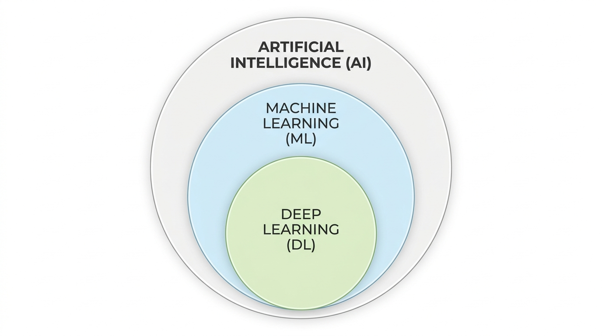
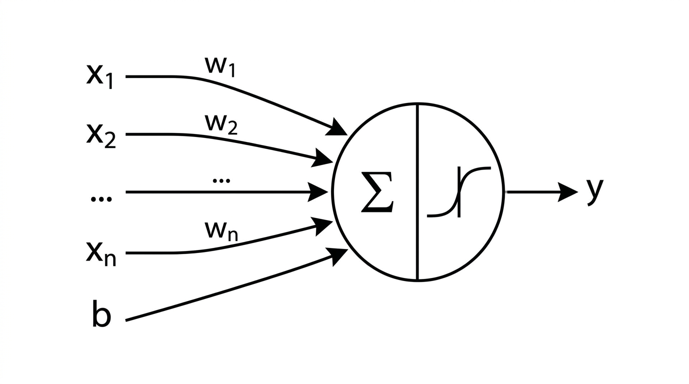
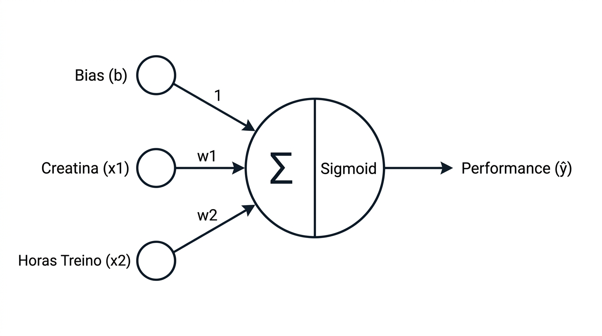
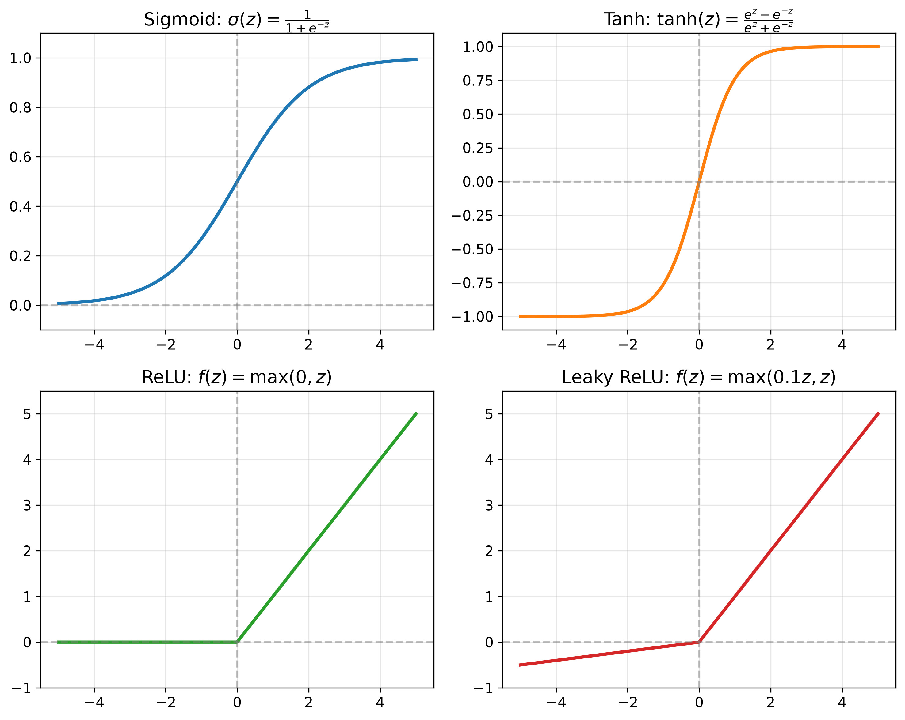
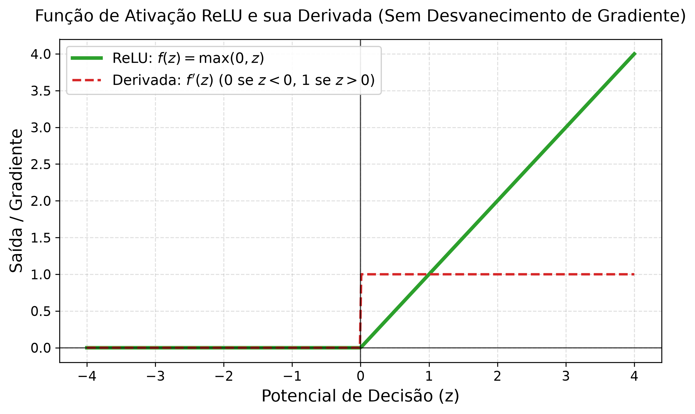
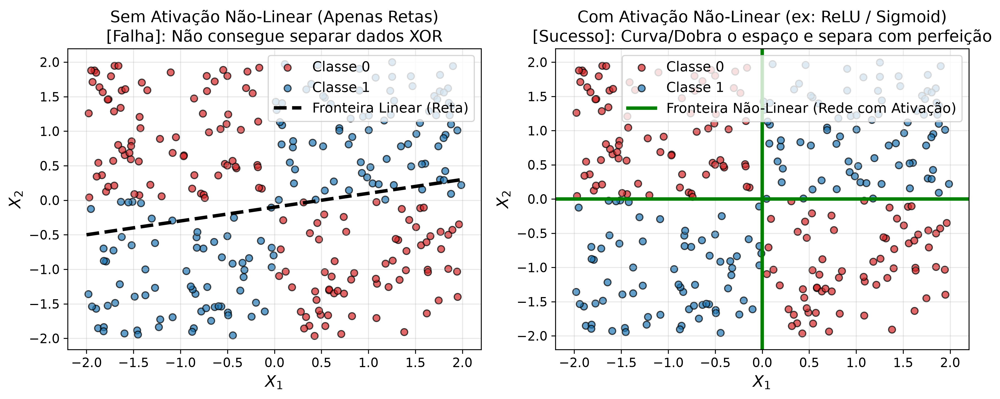
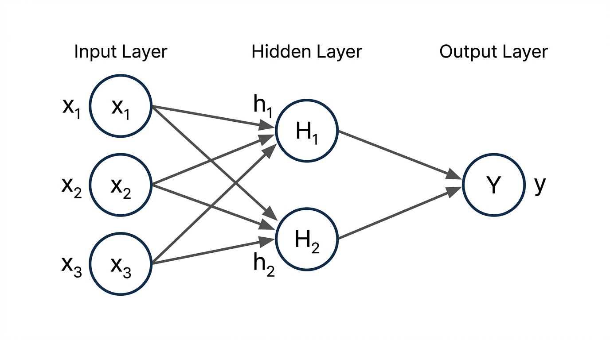

## Introdução ao Deep Learning

{fig-align="center" width="65%"}

::: {.notes}
**Falas do Apresentador:**
"Olá a todos! Sejam muito bem-vindos à nossa primeira aula sobre Redes Neurais Profundas com PyTorch.
Vejam a imagem na tela. Ela representa graficamente a relação de inclusão entre as três áreas mais faladas hoje.
1. **Inteligência Artificial (IA)**: É a área mais ampla e de fora do diagrama, focada em sistemas que simulam algum aspecto da inteligência humana.
2. **Machine Learning (ML)**: É a subárea azul. Em vez de programar regras estritas na mão, criamos algoritmos que aprendem regras e padrões de forma estatística a partir de dados estruturados.
3. **Deep Learning (DL)**: Representado na área verde interna. É um subcampo do ML focado em processar dados altamente complexos (como imagens, áudio e texto) utilizando arquiteturas com múltiplas camadas de neurônios artificiais.
Hoje, vamos focar no bloco elementar que está na base de todo o Deep Learning: o Perceptron!"
:::

---

## O Perceptron Clássico (Genérico)

{fig-align="center" width="70%"}

::: {.notes}
**Falas do Apresentador:**
"Este é o modelo convencional e clássico do Perceptron que vocês encontrarão na literatura e livros acadêmicos.
Ele é o processador básico de dados. Ele funciona recebendo sinais de entrada genéricos (x1, x2, até x_n).
Cada entrada tem um peso associado (w1, w2, até w_n) que regula a força ou a importância desse sinal.
Temos também a entrada especial de Bias (viés, b).
No núcleo do neurônio, o processamento ocorre em duas etapas:
Primeiro, calculamos uma combinação linear, ou soma ponderada (z), multiplicando as entradas pelos pesos e adicionando o viés.
Segundo, passamos o valor resultante por uma função de ativação 'f(z)' para decidir o nível de disparo ou a predição final 'y'."
:::

---

## O Neurônio Artificial (Aplicado)

{fig-align="center" width="70%"}

::: {.notes}
**Falas do Apresentador:**
"Agora, observem a transição lógica do modelo puramente abstrato para o nosso problema real de classificação esportiva.
As entradas genéricas 'x' agora têm nomes palpáveis: 'Creatina (x1)' (dosagem diária em gramas) e 'Horas de Treino (x2)'.
Os pesos (w1 e w2) vão definir o impacto de cada um desses hábitos no rendimento do atleta.
Nossa função de ativação abstrata é substituída pela função matemática Sigmoid.
A nossa saída predita é y-chapéu (ŷ), indicando a probabilidade de o atleta atingir alta performance baseado nestes hábitos."
:::

---

## A Matemática da Decisão

  

$$z = w_1 x_1 + w_2 x_2 + b$$

::: {.notes}
**Falas do Apresentador:**
"Neste slide, destacamos a equação da Combinação Linear que ocorre dentro do neurônio: z = w1*x1 + w2*x2 + b.
- **z**: É o potencial de decisão linear do modelo.
- **Entradas (x1, x2)**: Representam o consumo de Creatina em gramas (x1) e as Horas de Treino semanais (x2).
- **Pesos (w1, w2)**: Regulam o impacto e a inclinação da fronteira de decisão no gráfico.
- **Viés (b)**: É o deslocamento da linha. Sem o viés b, a reta seria forçada a passar pela origem (0,0), o que nos impediria de separar os dados se a fronteira estivesse distante da origem.
- Se z > 0, o potencial linear favorece a classe positiva (Alta Performance). Se z < 0, favorece a classe regular."
:::

---

## A Função de Ativação Sigmoid

  

$$\hat{y} = \sigma(z) = \frac{1}{1 + e^{-z}}$$

::: {.notes}
**Falas do Apresentador:**
"O cálculo linear anterior gera valores 'z' que variam de menos infinito a mais infinito. Mas para dizer se um atleta é 1 ou 0, precisamos de uma probabilidade entre 0 e 1.
É aí que entra a função Sigmoid, dada por 1 / (1 + e^-z):
- A Sigmoid achata qualquer soma ponderada z para o intervalo [0, 1].
- Interpretamos y-chapéu (ŷ) como a probabilidade de o atleta ser de Alta Performance.
- **Regra de Decisão**: Se ŷ >= 0.5 (50%), classificamos como Alta Performance (1). Se ŷ < 0.5, classificamos como Performance Regular (0).
- A fronteira de decisão exata ocorre em z = 0, pois sigma(0) = 0.5."
:::

---

## Por que precisamos de Ativações?

 

$$y = W_2 (W_1 x + b_1) + b_2 = (W_2 W_1) x + (W_2 b_1 + b_2) = W_{eq} x + b_{eq}$$

::: {.notes}
**Falas do Apresentador:**
"Por que precisamos dessas funções nas redes neurais?
Se não usássemos nenhuma função de ativação, multiplicar uma matriz de pesos por outra matriz de pesos resultaria em apenas uma grande multiplicação linear. Como vemos na fórmula na tela, uma rede de 100 camadas sem ativação teria exatamente a mesma capacidade de representação de um único neurônio linear!
As funções de ativação quebram essa linearidade. Elas atuam como dobradiças ou filtros não-lineares nas transformações."
:::

---

## Visão Geral das Funções de Ativação

{fig-align="center" width="75%"}

::: {.notes}
**Falas do Apresentador:**
"Como vemos no gráfico comparativo das quatro principais funções de ativação:
- **Sigmoid**: Ideal para a camada de saída em classificação binária, achatando valores para [0, 1].
- **Tanh**: Centrada em zero [-1, 1], facilita a convergência em camadas internas de redes recorrentes.
- **ReLU**: f(z) = max(0, z), o padrão absoluto para camadas ocultas em Deep Learning moderno.
- **Leaky ReLU**: Permite uma pequena inclinação em valores negativos para evitar neurônios mortos."
:::

---

## A Função ReLU (Rectified Linear Unit)

::: {.columns}

::: {.column width="45%"}
 

$$f(z) = \max(0, z)$$

 

$$f'(z) = \begin{cases} 0 & \text{se } z < 0 \\ 1 & \text{se } z > 0 \end{cases}$$
:::

::: {.column width="55%"}
{fig-align="center" width="90%"}
:::

:::

::: {.notes}
**Falas do Apresentador:**
"Esta é a ReLU, a função de ativação mais utilizada no mundo do Deep Learning moderno.
- **Definição Matemática**: f(z) é igual a zero se z for menor ou igual a zero, e igual a z se z for positivo.
- **Derivada**: Observem a linha vermelha tracejada no gráfico: para qualquer valor positivo z > 0, o gradiente da ReLU é constante e exatamente igual a 1.0!
- Essa característica de derivada constante igual a 1.0 é fundamental para o aprendizado em redes profundas."
:::

---

## Vantagens da Função ReLU

  

1. **Simplicidade Computacional**
2. **Gradiente Constante (Combate ao Vanishing Gradient)**
3. **Esparsidade de Representação**

::: {.notes}
**Falas do Apresentador:**
"Por que essa função tão simples superou a Sigmoid e a Tanh nas camadas ocultas?
1. **Simplicidade Computacional**: A ReLU exige apenas comparar se o valor é maior que zero (if z > 0), economizando bilhões de operações exponenciais em GPUs.
2. **Gradiente Constante**: Como a derivada é 1.0 para z > 0, o sinal do erro flui sem atenuação durante o backpropagation, combatendo o desvanecimento do gradiente.
3. **Esparsidade**: Zera neurônios inativos (z <= 0), fazendo com que apenas as características mais relevantes fiquem ativas."
:::

---

## A Variante Leaky ReLU

 

$$f(z) = \max(\alpha z, z) \quad (\text{onde } \alpha = 0.1)$$

::: {.notes}
**Falas do Apresentador:**
"Embora a ReLU seja fantástica, ela possui uma limitação conhecida como 'Neurônio Morto' (Dying ReLU). Se durante o treinamento a entrada de um neurônio se tornar consistentemente negativa, a saída será sempre zero e o gradiente também será zero, impedindo a atualização dos pesos.
A Leaky ReLU resolve isso introduzindo uma inclinação suave (como 0.1 * z) para valores negativos. Assim, mesmo neurônios inativos continuam recebendo uma fração de gradiente para poderem voltar a aprender durante o treinamento."
:::

---

## O Desafio dos Problemas Não-Lineares

::: {.columns}

::: {.column width="50%"}
### Problemas Lineares
* Dados separáveis por uma única reta ou plano.
:::

::: {.column width="50%"}
### Problemas Não-Lineares (XOR)
* Classes cruzadas em quadrantes. Nenhuma reta consegue separar sem erros.
:::

:::

::: {.notes}
**Falas do Apresentador:**
"No mundo real, quase nenhum problema de imagem, texto ou negócios é linearmente separável. 
Se tentarmos desenhar qualquer linha reta para separar dados no padrão XOR, nós SEMPRE vamos errar metade das amostras."
:::

---

## Demonstração Gráfica: Curvando o Espaço

{fig-align="center" width="75%"}

::: {.notes}
**Falas do Apresentador:**
"No gráfico da esquerda, um modelo linear simples falha ao tentar separar os dados XOR com uma reta.
No gráfico da direita, ao adicionar uma camada oculta com funções de ativação (como ReLU ou Sigmoid), a rede ganha a capacidade de criar curvas de decisão perfeitas!
É essa propriedade de curvar/distorcer o espaço cartesiano que permite às redes neurais profundas resolverem tarefas complexas de Visão Computacional e NLP."
:::

---

## Indo Além: Redes Multicamadas (MLP)

{fig-align="center" width="65%"}

::: {.notes}
**Falas do Apresentador:**
"Para combinar múltiplos neurônios e resolver esses problemas complexos, nós os organizamos em camadas, formando uma MLP (Multi-Layer Perceptron).
Como vemos no diagrama:
1. **Camada de Entrada**: Recebe dados brutos (x1, x2, x3).
2. **Camada Oculta**: Neurônios intermediários (h1, h2) que extraem representações não-lineares.
3. **Camada de Saída**: O neurônio final (y) gera a resposta combinada."
:::

---

## Matemática da MLP: Camada Oculta

 

$$h_1 = \sigma(w_{11} x_1 + w_{21} x_2 + w_{31} x_3 + b_{h1})$$

$$h_2 = \sigma(w_{12} x_1 + w_{22} x_2 + w_{32} x_3 + b_{h2})$$

::: {.notes}
**Falas do Apresentador:**
"Cada neurônio da camada oculta (h1 e h2) é um Perceptron completo processando as mesmas entradas de forma independente.
- h1 multiplica as entradas x1, x2, x3 pelos pesos da primeira linha, adiciona o viés b_h1 e aplica a Sigmoid.
- h2 faz o mesmo cálculo usando seu próprio conjunto de pesos e viés b_h2.
Cada neurônio aprende a detectar um aspecto ou característica diferente dos dados."
:::

---

## Matemática da MLP: Camada de Saída

 

$$\hat{y} = \sigma(v_1 h_1 + v_2 h_2 + b_o)$$

::: {.notes}
**Falas do Apresentador:**
"Na camada de saída, o neurônio final trata os valores processados por h1 e h2 como suas novas entradas. Ele aplica os pesos v1 e v2 da segunda camada, adiciona o viés de saída b_o e passa pela Sigmoid para produzir a probabilidade final y-chapéu."
:::

---

## Dinâmica com Planilha: Ajustando o Neurônio

  

* **Arquivo**: `simulacao_perceptron.xlsx`
* **Objetivo**: Mudar $W_1$, $W_2$ e $Bias$ para classificar os 20 atletas e zerar a Loss.

::: {.notes}
**Falas do Apresentador:**
"Preparamos uma planilha interativa chamada simulacao_perceptron.xlsx. Nela, constam os dados de 20 atletas. 
Vocês devem alterar manualmente as variáveis de W1, W2 e Bias na planilha para ver a reta divisória se ajustar e a perda despencar."
:::

---

## Transição para o PyTorch

::: {.columns}

::: {.column width="33%"}
### 1. Tensores
* Arrays multidimensionais em GPU.
:::

::: {.column width="33%"}
### 2. Autograd
* Diferenciação automática de gradientes.
:::

::: {.column width="33%"}
### 3. Otimizadores
* Ajuste automático dos pesos (SGD, Adam).
:::

:::

 

> **Próximo Passo**: Abrir o Jupyter Notebook `aula_01_introducao_deep_learning.ipynb`!

::: {.notes}
**Falas do Apresentador:**
"O PyTorch substitui nosso ajuste manual por três pilares: Tensores, Autograd e Otimizadores. Vamos agora abrir o nosso Jupyter Notebook!"
:::
